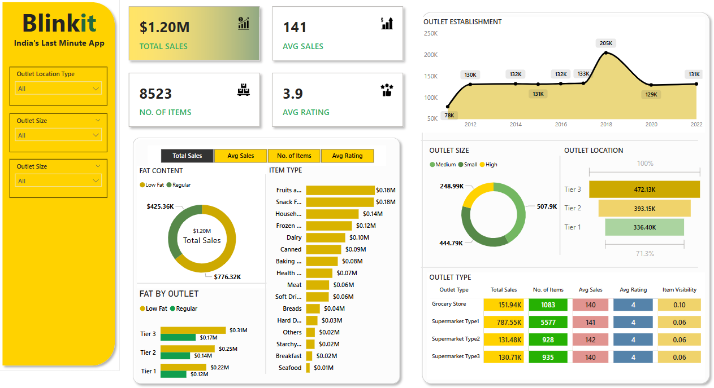

# 🛒 BlinkIT Grocery Sales Analysis – Power BI Dashboard

✨ *Turning raw grocery data into powerful business insights* ✨  

Welcome to the **BlinkIT Grocery Sales Analysis Project**, where data meets decision-making.  
This project demonstrates how **Power BI** can be used to analyze, visualize, and extract meaningful insights from real-world grocery sales data.

---

## 🚀 What’s Inside This Project?

📊 **Interactive Power BI Dashboard**  
📁 **Cleaned & structured dataset**  
📈 **Business-driven KPIs & insights**  
💼 **Resume & recruiter-ready analytics project**

---

## 🗂️ Project Files Overview

### 📌 Dataset
Raw grocery sales data used for analysis  
👉 [📂 BlinkIT Grocery Data (Excel)](Dataset/BlinkIT%20Grocery%20Data.xlsx)

---

### 📌 Dashboard
Power BI dashboard + visual preview  
👉 📊 [Download Power BI File (.pbix)](blinkit%20analysis.pbix)  
👉 🖼️ [View Dashboard Image](blinkit_dashboard.png)

---

## 🔍 Key Insights Uncovered

📈 **Total Sales & Revenue Performance**  
🏬 **Outlet-wise Sales Comparison**  
📦 **Category & Item Type Analysis**  
🛒 **Customer Purchase Patterns**  
📊 **KPIs:** Total Sales, Avg Sales, Quantity Sold  

Each visual is designed to help stakeholders **understand performance at a glance**.

---

## 🛠️ Tools & Technologies Used

- **Power BI**
- **Power Query** (Data Cleaning & Transformation)
- **DAX Measures**
- **Data Modeling**
- **Interactive Visuals & Filters**
- **Excel (.xlsx) Dataset**

---

## 🎨 Dashboard Preview

✨ *A glimpse of the interactive Power BI dashboard* ✨  

---

## 💡 Business Value

This dashboard helps businesses to:
- Identify top-performing outlets and categories  
- Track overall sales performance  
- Improve inventory & sales strategy  
- Make **data-driven decisions faster**

---

## 👩‍💻 About the Creator

**Mansi Kumari**  
📊 Aspiring Data Analyst  
💡 Excel | Power BI | SQL | Data Visualization  

🔗 GitHub: https://github.com/mansii74  

---

⭐ *If you like this project, consider giving it a star — it really helps!* ⭐
